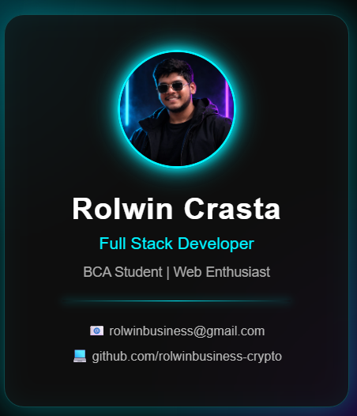

# 👋 Hey, I'm Rolwin Crasta

### 💻 Full Stack Developer | BCA Student | Web Enthusiast

  

I build modern, responsive web experiences and I'm currently expanding my skills across web development, Java, and application development.

---

🚀 **Currently Learning:** Full Stack Development  
💡 **Interested In:** Web Development • Java • App Development  
🎯 **Goal:** Become a professional software developer

---

## 🛠️ Tech Stack

### 🌐 Web Development

### ⚙️ Backend & Programming

### 🗄️ Database & Tools

## 🚀 Featured Projects

### 💻 Futuristic Developer Identity Card

A futuristic developer identity card built using HTML5 and CSS3.

**Highlights:**
- 🌑 Dark futuristic UI
- ⚡ Neon effects
- 🪟 Glassmorphism
- ✨ CSS animations
- 📱 Responsive design

🔗 **[View Project on GitHub](https://github.com/rolwinbusiness-crypto/IdentityCard)**

---

### 🌐 Personal Portfolio

My personal developer portfolio showcasing my skills, projects, certifications, resume, and contact information.

**Built With:**
- HTML5
- CSS3
- JavaScript
- Git & GitHub

🔗 **[View Project on GitHub](https://github.com/rolwinbusiness-crypto/FirstProject)**  
🌍 **[Live Portfolio](https://rolwinbusiness-crypto.github.io/FirstProject/)**

---

## 📊 GitHub Stats

  

  

## 🤝 Connect With Me

  

  

---

### 💡 Currently Building

🚀 Real-world projects  
💻 Improving my development skills  
📚 Learning new technologies  
🎯 Preparing for my software development career

---

⭐ **Thanks for visiting my profile!**
